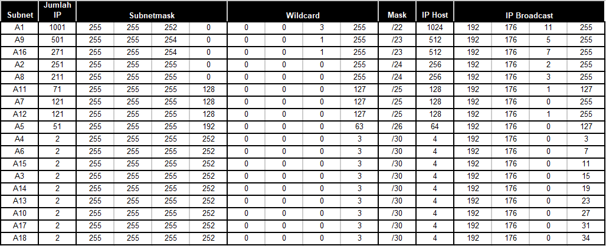
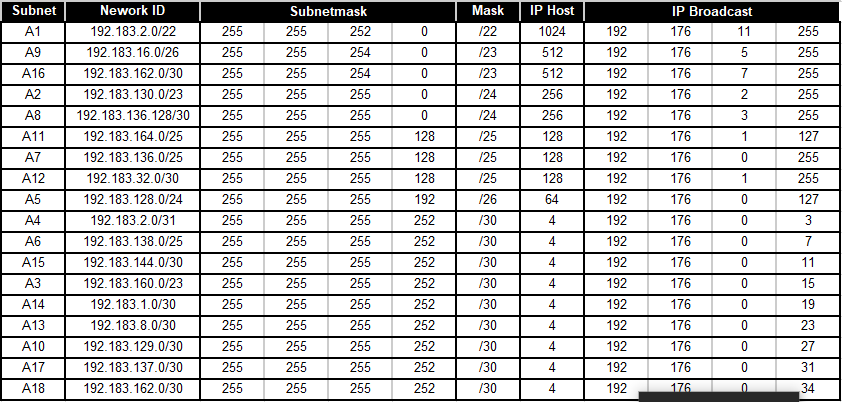

# Jarkom-Modul-4-F05-2022

## Kelompok F05

| Nama                       | NRP        |
| -------------------------- | ---------- |
| Fahmi Muhazir              | 5025201043 |
| Moh Akmal Ali Dzikri       | 5025201204 |
| Ferry Nur Alfian Eka Putra | 5025201214 |

## Soal

 

### Catatan

1. Deadline hari Rabu, 24 November pukul 22.00
2. Soal shift dikerjakan pada Cisco Packet Tracer dan GNS3 menggunakan metode perhitungan CLASSLESS yang berbeda.
3. Bila di CPT menggunakan VLSM, maka di GNS3 menggunakan CIDR atau Sebaliknya
4. Jika tidak ada pemberitahuan revisi soal dari asisten, berarti semua soal BERSIFAT BENAR dan DAPAT DIKERJAKAN.
5. Untuk di GNS3 CLOUD merupakan NAT1 jangan sampai salah agar bisa terkoneksi internet.
6. Pembagian IP menggunakan Prefix IP yang telah ditentukan pada modul pengenalan
7. Pembagian IP dan routing harus SE-EFISIEN MUNGKIN.

### Hal yang perlu diperhatikan

1. Hasil perhitungan subnetting dan pohon pembagian IP serta file .pkt dikirim ke email asisten penguji
2. File yang didemokan adalah file .pkt yang telah dikirim ke asisten.

### Pengurangan nilai akan dilakukan ketika:

1. Melanggar salah satu dari tulisan diatas.
2. Tidak menggunakan PREFIX ip yang ditetapkan sebelumnya
3. Hasil perhitungan untuk VLSM / CIDR, berbeda dengan di CPT / GNS3
4. Pembagian IP kurang efisien
5. Routing kurang efisien
6. Tidak bisa menjelaskan cara perhitungan VLSM dan CIDR

### Ralat:

Tidak perlu menggunakan DHCP untuk pembagian IP pada GNS3

 

## Jawaban

Ada beberapa tahap yang perlu dilakukan dalam praktikum ini yaitu :

1. Labelling subnet
2. Subnetting
   1. VLSM
   2. CIDR
3. Topologi
4. Konfigurasi

### Labelling & Toppologi

Pada tahap labelling, ada total 18 subnet. Kami memberikan A1 kepada subnet paling kiri dari cloud.

Berikut Topologi dengan label / subnet yang ditandai

 

### Subnetting

Setelah selesai menentukan berapa banyak subnet yaitu 18 subnet, serta menamai dari A1-A18 dan mendapatkan banyaknya IP yang dibutuhakan, selanjutnya lakukan pembagian nid subnet

#### VLSM

Berikut merupakan tree yang terbentuk:

 

Maka, telah didapatkan tabel NID subnet dengan metode VLSM

 
                      

                      
 
